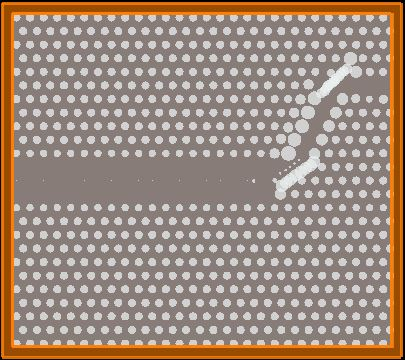
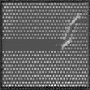

# AI-Driven-Photonic-Device-Design-and-Optimization
# Photonic-Crystal-GAN

A GAN-based image generation pipeline developed in **PyTorch** for synthesizing **silicon photonic crystal structures**.

The objective of this project is to generate photonic crystal images from randomly sampled noise that closely resemble real **Lumerical FDTD** simulation outputs. The generated structures are subsequently evaluated using the Lumerical FDTD simulator to measure their light transmission efficiency. Images achieving a transmission efficiency of **75% or higher** are added back into the training dataset, enabling an iterative improvement process with a long-term target of consistently exceeding **80% transmission efficiency**.
Unlike conventional GAN applications that rely on thousands of training samples, this project is trained on only **34 custom Lumerical FDTD simulation images**. This limited dataset presents a significant challenge, and every architectural modification and training strategy adopted throughout the project has been specifically designed to address this constraint.

---

## Architecture Progression

Each model was developed to overcome the limitations identified in the previous architecture. Rather than serving as a step-by-step tutorial, this section documents the actual research progression and experimental findings.

| Stage | Folder             | Architecture                        | Key Result                                                                                                                                                                                                                                    |
| ----- | ------------------ | ----------------------------------- | --------------------------------------------------------------------------------------------------------------------------------------------------------------------------------------------------------------------------------------------- |
| **1** | `Vanilla_GAN`      | Fully Connected GAN                 | Severe mode collapse observed around epoch 300. Discriminator loss ≈ 0.005 and Generator loss ≈ 8.5. The fully connected architecture failed to preserve spatial information required for photonic crystal structures.                        |
| **2** | `DCGAN_STAGE_1`    | DCGAN (Paper Specification, 20×20)  | Reduced mode collapse compared to the baseline, but the generated binary structures converged to a single pattern. Continuous outputs remained blurry, indicating that a 20×20 resolution was insufficient for preserving structural details. |
| **3** | `STABILIZED_DCGAN` | DCGAN with Stabilization Techniques | Successfully achieved a near Nash Equilibrium (≈0.693). The generator learned the periodic hole lattice and waveguide defect channel topology, producing significantly improved structural representations.                                   |

---

## Current Status

The project is currently under active research and development. **V3 WGAN-GP** represents the best-performing architecture so far. Ongoing optimization focuses on generating photonic crystal structures that consistently achieve a **minimum transmission efficiency of 75%** during Lumerical FDTD evaluation.

---

## Project Structure

```text
photonic-crystal-gan/
├── Vanilla_GAN/                    # Stage 1 – Fully Connected GAN baseline
├── DCGAN_STAGE_1/                  # Stage 2 – Paper-specification DCGAN (20×20)
├── STABILIZED_DCGAN/               # Stage 3 – Stabilized DCGAN (128×128)
└── pixel_mapping/                  # Validation utility for silicon hole measurement
```

---

## Dataset

The training dataset consists of **34 grayscale photonic crystal images** generated through **Lumerical FDTD simulations**. These images are custom-created and are not publicly available. Before training, all images are resized and normalized to the range **[-1, 1]**. Each sample represents a periodic silicon-air hole lattice containing a waveguide defect channel.

---

## Technology Stack

* Python
* PyTorch
* torchvision
* OpenCV
* TensorBoard
* Matplotlib
* PIL (Python Imaging Library)

---


## Validation Utility

### `pixel_mapping/` — Silicon Hole Diameter Measurement

This module provides a dedicated utility for measuring the diameter of silicon holes in both **pixels** and **nanometres** from cropped photonic crystal images. It is primarily used to compare the geometric characteristics of GAN-generated structures with the highest-quality Lumerical FDTD reference image. Particular emphasis is placed on the **60-degree waveguide bend (junction region)**, as it represents one of the most physically significant areas of the photonic crystal design.

For additional implementation details, refer to `pixel_mapping/README.md`.

---


## Visual Progression

### Real Photonic Crystal — Training Dataset



This image represents one of the **34 Lumerical FDTD simulation samples** used during training. It serves as the reference pattern that the GAN attempts to learn, consisting of a periodic silicon-air hole lattice with a diagonal waveguide defect channel.

---


### Stabilized DCGAN — 128×128 Output



The stabilized DCGAN successfully learned the overall topology of the photonic crystal, including the periodic lattice arrangement and the waveguide defect channel. Although the generated images remain slightly blurry with reduced contrast, they represent the highest-quality results achieved by the DCGAN architecture when trained on a dataset of only 34 images.
